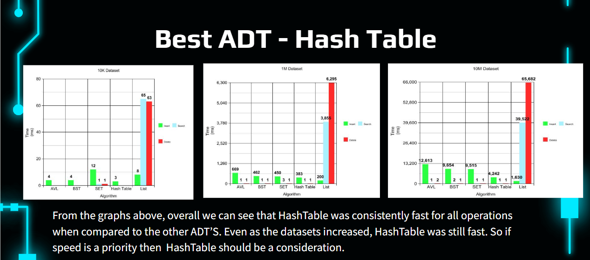

# 🎬 SearchFlix — Large-Scale Movie Search Engine

> A high-performance search engine backend benchmarked across 10M+ movie records — built to determine the optimal Abstract Data Type for large-scale content search.

Built by **Victory Orobosa** (Team Lead), Emmanuel Johnson & Chima Onochie


---

## The problem

Streaming platforms like Netflix manage catalogs of millions of titles. The data structure powering their search directly determines how fast users find content — and at scale, the wrong choice creates real, measurable latency.

This project answers the question: **which data structure actually wins for large-scale content search, and by how much?**

---

## What it does

SearchFlix implements a movie search engine backend in C++ and benchmarks **five Abstract Data Types** against the same dataset across three core operations — insert, search, and delete — at three dataset sizes: **10K, 1M, and 10M records**.

### Data structures evaluated

| ADT | Search | Insert | Delete | Notes |
|---|---|---|---|---|
| Linear Search (`std::list`) | O(n) | O(1) | O(n) | Baseline — worst case |
| Binary Search Tree (BST) | O(log n) avg | O(log n) avg | O(log n) avg | Degrades on sorted input |
| AVL Tree | O(log n) guaranteed | O(log n) | O(log n) | Self-balancing — consistent |
| Hash Table | O(1) avg | O(1) avg | O(1) avg | Fastest across all operations |
| BST Set (`std::set`) | O(log n) | O(log n) | O(log n) | Unique values only |

---

## Benchmark results

### 10K Dataset (ms)

| ADT | Insert | Search | Delete |
|---|---|---|---|
| AVL | 4 | 1 | 1 |
| BST | 4 | 1 | 1 |
| Set | 12 | 1 | 1 |
| **Hash Table** | **3** | **1** | **1** |
| List | 8 | 65 | 63 |

### 1M Dataset (ms)

| ADT | Insert | Search | Delete |
|---|---|---|---|
| AVL | 669 | 1 | 1 |
| BST | 462 | 1 | 1 |
| Set | 450 | 3 | 1 |
| **Hash Table** | **383** | **1** | **1** |
| List | 200 | 3,850 | 6,295 |

### 10M Dataset (ms)

| ADT | Insert | Search | Delete |
|---|---|---|---|
| AVL | 12,613 | 1 | 2 |
| BST | 9,654 | 2 | 1 |
| Set | 9,515 | 1 | 1 |
| **Hash Table** | **4,242** | **1** | **1** |
| List | 1,630 | 39,522 | 65,682 |

---

## Key finding

**Hash Table is the optimal ADT for large-scale content search.**

At 10M records, Hash Table insertion was ~66% faster than AVL Tree and ~56% faster than BST. Search and deletion times remained at or near 1ms across all dataset sizes — consistent O(1) average performance regardless of scale.

`std::list` showed the sharpest degradation — deletion at 10M records took **65,682ms**, making it completely unsuitable for any application requiring fast data access at scale.



---

## Real-world implications

| Use case | Best ADT | Why |
|---|---|---|
| Fast lookup by ID | Hash Table | O(1) average — unmatched at scale |
| Autocomplete / prefix search | AVL Tree | Ordered traversal, guaranteed balance |
| Sorted catalog browsing | AVL or Set | In-order traversal is natural |
| High-frequency inserts (live updates) | Hash Table | Lowest insert time at 10M records |

---

## Project structure

```
searchflix/
├── src/
│   ├── main.cpp             ← Driver program + benchmark runner
│   ├── avl.h                ← AVL Tree with auto-balancing (Victory)
│   ├── hashtable.h          ← Hash Table with chaining (Victory)
│   ├── bst.h                ← Binary Search Tree (Emmanuel)
│   ├── set_adt.h            ← BST Set using std::set (Emmanuel)
│   ├── list_adt.h           ← Linear Search using std::list (Emmanuel)
│   └── movie.h              ← Movie data model / struct
│
├── data/
│   └── movies.csv           ← Dataset (generate with data_gen.cpp)
│
├── results/
│   └── benchmark_results.csv ← Timing output across all structures
│
├── report/
│   └── SearchFlix_Report.pdf ← Full written analysis and findings
│
└── README.md
```

---

## How to run

### Prerequisites

- C++17 compatible compiler (g++ 9+ or clang++ 10+)
- Make (optional)

### Build and run

```bash
# Clone the repo
git clone https://github.com/victory113/ADT-Performance.git
cd ADT-Performance

# Compile
g++ -std=c++17 -O2 -o searchflix src/main.cpp

# Run benchmarks
./searchflix
```

The program will run insert, search, and delete benchmarks across all five ADTs and print timing results to the console.

### Generate a large dataset

```bash
g++ -std=c++17 -o data_gen src/data_gen.cpp
./data_gen 10000000 > data/movies.csv
```

---

## Team contributions

| Member | Role | Contributions |
|---|---|---|
| **Victory Orobosa** | **Team Lead** | Project skeleton, AVL Tree & Hash Table implementation, benchmark graphs, results analysis |
| Emmanuel Johnson | Developer | BST, BST Set, `std::list` implementation, slides, report sections |
| Chima Onochie | Developer | Hash Table support, slides, overall project analysis |

---

## Key engineering decisions

**Why AVL over standard BST for balanced trees?**
BSTs degrade to O(n) on sorted or nearly-sorted input. AVL Trees self-balance on every insert, guaranteeing O(log n) regardless of insertion order — critical when movie data arrives pre-sorted by title or ID.

**Why Hash Table collision resolution via chaining?**
Open addressing degrades significantly above a 70% load factor. Chaining with linked lists keeps performance more predictable under high-density loads at the 10M record scale.

**Why the `-O2` compiler flag?**
To simulate production-level compiled performance rather than unoptimized debug builds, making benchmark results reproducible and comparable to real deployed systems.

**Why `std::chrono` for timing?**
Provides nanosecond-level precision cross-platform, making results reproducible and comparable across machines.

---

## What I'd build next

- [ ] Trie implementation for autocomplete / prefix search
- [ ] Inverted index for full-text search across movie descriptions
- [ ] Interactive benchmark visualization dashboard (Python + matplotlib)
- [ ] Concurrent search using C++ threads to simulate multi-user load
- [ ] Web frontend to query the search engine live

---

## Author

**Victory Orobosa** — CS Junior @ University of Central Arkansas  
[LinkedIn](https://linkedin.com/in/victory-orobosa) · [GitHub](https://github.com/victory113)
